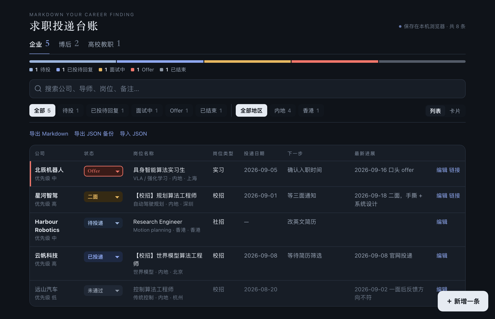
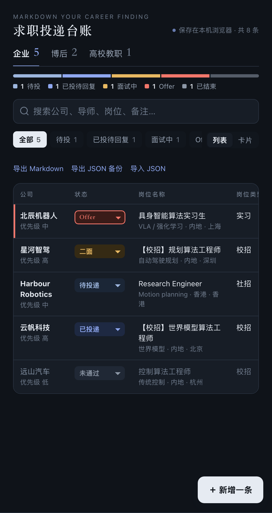

# Markdown Your Career Finding

一个给求职季用的投递台账：同时记录**企业秋招、博后申请、高校教职**三条线的投递情况和推进情况。手机上能直接打开和编辑，随时导出成 Markdown。

A lightweight job-search tracker for people running several tracks at once — industry roles, postdoc applications and faculty positions. Phone-first, no backend, exports to Markdown.

<p align="center">
  
  &nbsp;
  
</p>

<p align="center"><sub>截图中的公司、学校和人名均为虚构示例。界面会跟随系统的浅色 / 深色模式。</sub></p>

## 三种用法

| 方式 | 适合 | 文件 |
|---|---|---|
| 网页版 | 手机 / 电脑随手记，状态一键切换 | `index.html` |
| Markdown 模板 | 喜欢纯文本、想放进笔记或 Git 仓库 | `templates/tracker.md` |
| Excel 表 | 习惯表格、需要筛选和统计 | `python3 scripts/make_xlsx.py` 生成 |

## 网页版

直接用浏览器打开 `index.html`，或者开启 GitHub Pages 后用手机访问。

- 三个分类：企业 / 博后 / 高校教职，每类的字段名会跟着变（公司 ↔ 单位 ↔ 学校，岗位类型 ↔ 合作导师）。
- 状态下拉直接改，改动会自动在"推进记录"里记一笔；改成"已投递"时自动补上投递日期。
- 每条记录有一个推进时间线：投递、笔试、每一轮面试都可以记。
- 顶部按"待投 / 已投待回复 / 面试中 / Offer / 已结束"分组计数，点一下就是筛选。
- **导出 Markdown**：生成三张表 + 每条记录的时间线，粘进任何 `.md` 文件。
- **地区**：每条记录可标「内地 / 香港 / 海外」，筛选条右侧可按地区切换。
- **列表 / 卡片两种视图**，顶部进度条显示各阶段占比，搜索框可按公司、导师、岗位、备注和推进记录查找。
- **导出 / 导入 JSON**：换设备时搬数据用。

数据只保存在**当前浏览器的 localStorage** 里，不会上传到任何地方。代价是：换手机或清理浏览器数据前，记得先导出 JSON 备份。

## 内地使用注意事项

**页面本身在内地可以正常使用。** `index.html` 是单个自包含文件，不加载任何外部资源：没有 CDN 脚本、没有 Google Fonts、没有统计代码，字体用的是系统自带的宋体和黑体，数据只读写浏览器本地存储。断网也能用。

需要注意的是**怎么拿到它**和**怎么在多台设备上用**：

- **GitHub 访问不稳定。** `github.com`、`raw.githubusercontent.com` 和 GitHub Pages（`*.github.io`）在内地网络下经常打不开或很慢。`git clone` 失败时，可以在能访问的网络下用页面上的「Download ZIP」下载一次，之后就不再需要联网。
- **电脑上最稳的用法是本地文件。** 下载后直接双击 `index.html`，用 Chrome、Edge 或 Safari 打开即可，不需要起服务器。建议把这个标签页固定或加入书签。
- **手机上需要一个能访问的网址。** 手机浏览器一般不能像电脑那样直接运行本地 HTML 文件。想在手机上用，需要把 `index.html` 放到一个你在内地能打开的静态托管上，比如自己的服务器或对象存储的静态网站功能。国内云厂商的公网访问通常要求域名已备案。GitHub Pages 不适合作为内地手机端的入口。
- **数据不会跨设备同步。** 记录存在“当前设备的当前浏览器”里，手机和电脑各是一份。换设备时用「导出 JSON 备份」和「导入 JSON」搬运。
- **这些情况会丢数据，请定期导出备份：** 清理浏览器数据或使用清理类软件；无痕 / 隐私模式；微信、QQ 等 App 的内置浏览器（本地存储不可靠，请用系统浏览器打开）；同一个文件换了存放路径或换了浏览器打开（浏览器会当成另一个站点）。
- **需要手机电脑实时同步时，换用表格方案。** 用 `scripts/make_xlsx.py` 生成 Excel，或把「导出 Markdown」的内容整理成表格，导入飞书多维表格、腾讯文档或 WPS 云文档。这些服务在内地网络下可用，自带多端同步，多维表格还可以按「分类」建企业 / 博后 / 高校教职三个筛选视图。代价是没有本页面的界面。
- **安装 Excel 脚本的依赖较慢时**，可以换用国内镜像：`pip install openpyxl -i https://pypi.tuna.tsinghua.edu.cn/simple`。

## 状态口径

`待投递 → 待提交 → 已投递 → 简历筛选中 → 笔试/测评 → 一面 → 二面 → 三面/终面 → HR面 → Offer`，结束态为 `未通过` / `已放弃`。

## Excel 版

```bash
pip install openpyxl
python3 scripts/make_xlsx.py my-tracker.xlsx
```

生成四个工作表：总览（公式自动统计各状态数量）、企业秋招、博后申请、高校教职。状态、优先级、岗位类型是下拉菜单，整行按状态着色。

## 隐私

仓库里只有工具和示例数据。不要把自己的真实投递记录、简历或联系方式提交到公开仓库。

## License

MIT
